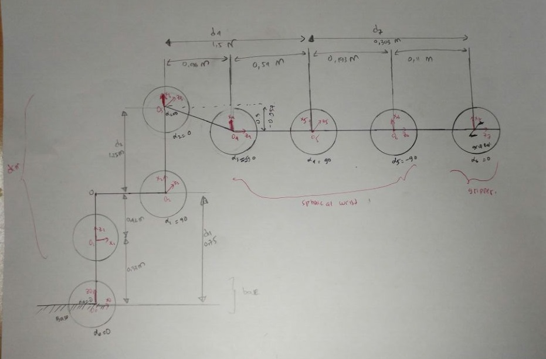
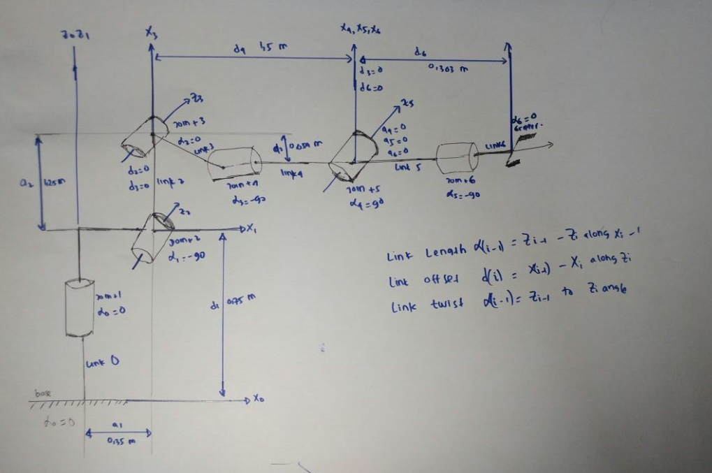
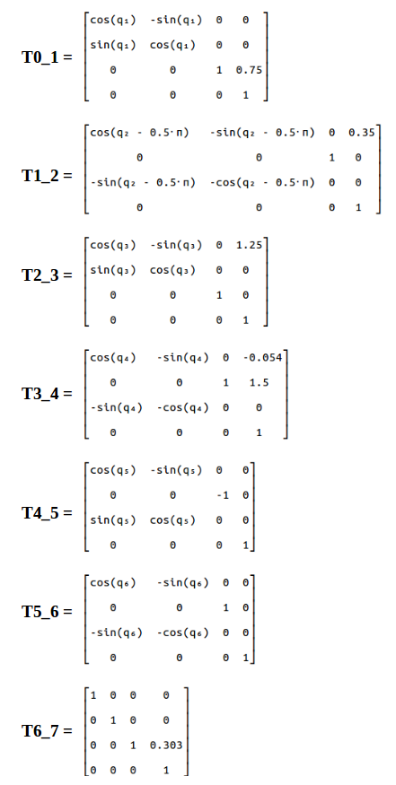
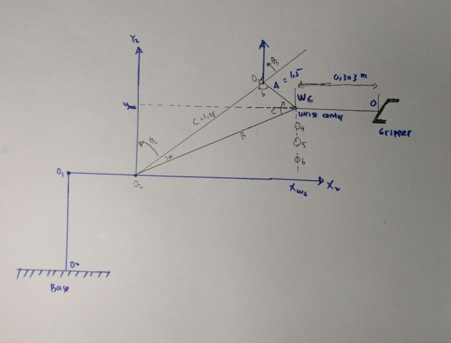
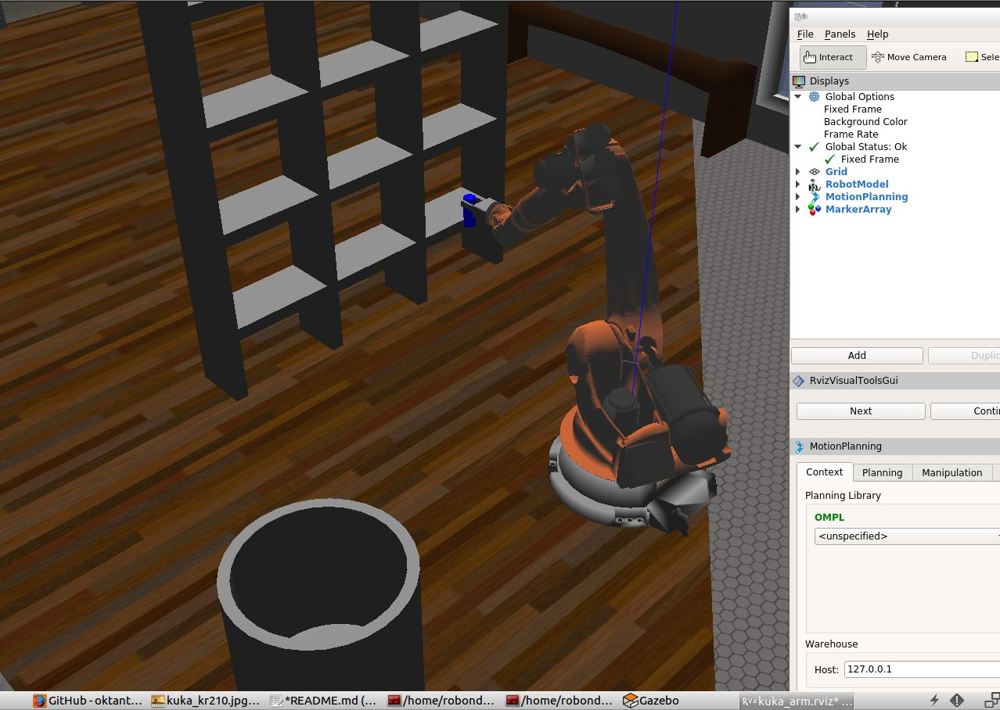

[](https://www.udacity.com/robotics)
## Project: Kinematics Pick & Place

### Kinematic Analysis
#### 1. Run the forward_kinematics demo and evaluate the kr210.urdf.xacro file to perform kinematic analysis of Kuka KR210 robot and derive its DH parameters.

Using the DH methods suggested by Udacity, the following sketch was completed and a DH table was constructed:

<p align="center">  </p>

We can further simplify by combining the last three joints (4,5, and 6) in in joint_5 since their axes in actual KR210 robot intersect at a single point which represent the center of the robot spherical wrist:

<p align="center">  </p>

### Kuka KR210 robot DH parameters.

We can generate the DH parameters table as following:

Links | i | alpha(i-1) | a(i-1) | d(i) | theta(i) |
:---: | :---: | :---: | :---: | :---: | :---: |
0->1 | 1 | 0 | 0 | 0.75 | q1 |
1->2 | 2 | -90 | 0.35 | 0 | -90+q2 |
2->3 | 3 | 0 |  | 1.25 | q3 |
3->4 | 4 | -90 | -0.05 | 1.5 | q4 |
4->5 | 5 | 90 | 0 | 0 | q5 |
5->6 | 6 | -90 | 0 | 0 | q6 |
6->7 | 7 | 0 | 0 | 0.303 | q7 |

in which q(i) is our input to joint angles (theta(i)).

I will be using python to code the forward kinematics:

To start with, we need the following imports:

```python
import numpy as np
from numpy import array
from sympy import symbols, cos, sin, pi, simplify, sqrt, atan2, pprint
from sympy.matrices import Matrix
```

Python code to represent DH parameters table is:

```python
# DH Table
s = {alpha0:      0, a0:      0, d1:  0.75, q1:        q1,
     alpha1: -pi/2., a1:   0.35, d2:     0, q2: -pi/2.+q2,
     alpha2:      0, a2:   1.25, d3:     0, q3:        q3,
     alpha3: -pi/2., a3: -0.054, d4:  1.50, q4:        q4,
     alpha4:  pi/2., a4:      0, d5:     0, q5:        q5,
     alpha5: -pi/2., a5:      0, d6:     0, q6:        q6,
     alpha6:      0, a6:      0, d7: 0.303, q7:         0}
```

#### 2. Using the DH parameter table you derived earlier, create individual transformation matrices about each joint. In addition, also generate a generalized homogeneous transform between base_link and gripper_link using only end-effector(gripper) pose.

Using above DH parameter table, we can create individual transforms between various links. DH convention uses four individual transforms: 

<p align="center">  </p>

Using the DH parameter table, we can transform from one frame to another using the following matrix:

<p align="center">  </p>

Python code for a function that will return the individual frame transformation matrix is as following:

```python
# Function to return homogeneous transform matrix

def TF_Mat(alpha, a, d, q):
    TF = Matrix([[            cos(q),           -sin(q),           0,             a],
                 [ sin(q)*cos(alpha), cos(q)*cos(alpha), -sin(alpha), -sin(alpha)*d],
                 [ sin(q)*sin(alpha), cos(q)*sin(alpha),  cos(alpha),  cos(alpha)*d],
                 [                 0,                 0,           0,             1]])
    return TF
```
Then using the following code to substitute the DH parameters into the transformation matrix: 

```python
   ## Substitute DH_Table
T0_1 = TF_Mat(alpha0, a0, d1, q1).subs(dh)
T1_2 = TF_Mat(alpha1, a1, d2, q2).subs(dh)
T2_3 = TF_Mat(alpha2, a2, d3, q3).subs(dh)
T3_4 = TF_Mat(alpha3, a3, d4, q4).subs(dh)
T4_5 = TF_Mat(alpha4, a4, d5, q5).subs(dh)
T5_6 = TF_Mat(alpha5, a5, d6, q6).subs(dh)
T6_7 = TF_Mat(alpha6, a6, d7, q7).subs(dh)

```

To get the composition of all transforms from base to gripper we simply multiply the individual matrices using the following code:

```python
# Composition of Homogeneous Transforms
# Transform from Base link to end effector (Gripper)
T0_2 = (T0_1 * T1_2) ## (Base) Link_0 to Link_2
T0_3 = (T0_2 * T2_3) ## (Base) Link_0 to Link_3
T0_4 = (T0_3 * T3_4) ## (Base) Link_0 to Link_4
T0_5 = (T0_4 * T4_5) ## (Base) Link_0 to Link_5
T0_6 = (T0_5 * T5_6) ## (Base) Link_0 to Link_6
T0_7 = (T0_6 * T6_7) ## (Base) Link_0 to Link_7 (End Effector)
```

In order to apply correction needed to account for Orientation Difference Between definition of Gripper Link_7 in URDF versus DH Convention we need to rotate around y then around z axis:

```python
R_y = Matrix([[ cos(-np.pi/2),           0, sin(-np.pi/2), 0],
              [             0,           1,             0, 0],
              [-sin(-np.pi/2),           0, cos(-np.pi/2), 0],
              [             0,           0,             0, 1]])

R_z = Matrix([[    cos(np.pi), -sin(np.pi),             0, 0],
              [    sin(np.pi),  cos(np.pi),             0, 0],
              [             0,           0,             1, 0],
              [             0,           0,             0, 1]])


R_corr = (R_z * R_y)

T_total= (T0_7 * R_corr)
```

Individual transform matrices about each joint using the DH table are as following:

<p align="center">  </p>

#### 3. Decouple Inverse Kinematics problem into Inverse Position Kinematics and inverse Orientation Kinematics; doing so derive the equations to calculate all individual joint angles.

## Inverse Kinematics Analysis

Since the last three joints in KUKA KR210 robot (Joint_4, Joint_5, and Joint_6) are revolute and their joint axes intersect at a single point (Joint_5), we have a case of spherical wrist with joint_5 being the common intersection point; the wrist center. This allows us to kinematically decouple the IK problem into Inverse Position and Inverse Orientation problems.

First step is to get the end-effector position(Px, Py, Pz) and orientation (Roll, Pitch, Yaw) from the test cases data class as shown in below code:

```python
    # Requested end-effector (EE) position
    px = req.poses[x].position.x
    py = req.poses[x].position.y
    pz = req.poses[x].position.z
    
    # store EE position in a matrix
    EE = Matrix([[px],
                 [py],
                 [pz]])
    
    # Requested end-effector (EE) orientation
    (roll,pitch,yaw) = tf.transformations.euler_from_quaternion(
        [req.poses[x].orientation.x,
         req.poses[x].orientation.y,
         req.poses[x].orientation.z,
         req.poses[x].orientation.w])
```

We will need rotation matrix for the end-effector:

R_rpy = Rot(Z, yaw) * Rot(Y, pitch) * Rot(X, roll)

and orientation difference correction matrix (Rot_corr) as earlier discussed in FK section.

R_EE = R_rpy * R_corr

We substitute the obtained roll, pitch and yaw in the final rotation matrix. Python Code is as following:

```python
 # Find EE rotation matrix RPY (Roll, Pitch, Yaw)
    r,p,y = symbols('r p y')

    # Roll
    ROT_x = Matrix([[       1,       0,       0],
                    [       0,  cos(r), -sin(r)],
                    [       0,  sin(r),  cos(r)]])
    # Pitch
    ROT_y = Matrix([[  cos(p),       0,  sin(p)],
                    [       0,       1,       0],
                    [ -sin(p),       0,  cos(p)]])
    # Yaw
    ROT_z = Matrix([[  cos(y), -sin(y),       0],
                    [  sin(y),  cos(y),       0],
                    [       0,       0,       1]])

    ROT_EE = ROT_z * ROT_y * ROT_x

    # Correction Needed to Account for Orientation Difference Between
    # Definition of Gripper Link_G in URDF versus DH Convention

    ROT_corr = ROT_z.subs(y, radians(180)) * ROT_y.subs(p, radians(-90))
    
    ROT_EE = ROT_EE * ROT_corr
    ROT_EE = ROT_EE.subs({'r': roll, 'p': pitch, 'y': yaw})
```
In Python code:

```python
    # Calculate Wrest Center
    WC = EE - (0.303) * ROT_EE[:,2]
```
WC is now having position of wrist center (Wx, Wy, Wz).

To find Theta1, we need to project Wz onto the ground plane Thus,

**Theta1=atan2(Wy,Wx)**

```python
    # Calculate theat1
    theta1 = atan2(WC[1],WC[0])
```
Using trigonometry, we can calculate **Theta2 dan Theta3**. 

We have a triangle (the green color in below figure) with two sides known to us (**A** = d4 = 1.5) and (**C** = a2 = 1.25), the 3rd side (**B**) can be calculated as following:

<p align="center">  </p>

Below is the same in Python code:

```python
    #SSS triangle for theta2 and theta3
    A = 1.501
    C = 1.25
    B = sqrt(pow((sqrt(WC[0]*WC[0] + WC[1]*WC[1]) - 0.35), 2) + pow((WC[2] - 0.75), 2))
``` 
Now since we have all three sides of the triangle known to us we can calculate all of the three inner angles of the triangle from the known three sides Using trigonometry (specifically the **Cosine Laws** SSS type).

<p align="center">  </p>

The same in Python code:

 ```python
    a = acos((B*B + C*C - A*A) / (2*B*C))
    b = acos((A*A + C*C - B*B) / (2*A*C))
    c = acos((A*A + B*B - C*C) / (2*A*B))
```
Finally we calculate **Theta2** and **Theta3**

```python
    theta2 = pi/2 - a - atan2(WC[2]-0.75, sqrt(WC[0]*WC[0]+WC[1]*WC[1])-0.35)
    theta3 = pi/2 - (b+0.036) # 0.036 accounts for sag in link4 of -0.054m
```
<p align="center">  </p>

### Inverse Orientation

For the **Inverse Orientation** problem, we need to find values of the final three joint variables **Theta4, Theta5 and Theta6**.

Using the individual DH transforms we can obtain the resultant transform and hence resultant rotation by:

**R0_6 = R0_1*R1_2*R2_3*R3_4*R4_5*R5_6**

Since the overall RPY (Roll Pitch Yaw) rotation between base_link and gripper_link must be equal to the product of individual rotations between respective links, following holds true:

**R0_6 = R_EE**

where,

**R_EE** = Homogeneous RPY rotation between base_link and gripper_link as calculated above.

We can substitute the values we calculated for **Theta1, Theta2 and Theta3**. in their respective individual rotation matrices and pre-multiply both sides of the above equation by **inv(R0_3)** which leads to:

**R3_6 = inv(R0_3) * R_EE**

<p align="center">  </p>

The resultant matrix on the RHS (Right Hand Side of the equation) does not have any variables after substituting the joint angle values, and hence comparing LHS (Left Hand Side of the equation) with RHS will result in equations for **Theta4, Theta5 and Theta6**.

```python
    # Extract rotation matrix R0_3 from transformation matrix T0_3 the substitute angles q1-3
    R0_3 = T0_1[0:3,0:3] * T1_2[0:3,0:3] * T2_3[0:3,0:3]
    R0_3 = R0_3.evalf(subs={q1: theta1, q2: theta2, q3:theta3})

    # Get rotation matrix R3_6 from (inverse of R0_3 * R_EE)
    R3_6 = R0_3.inv(method="LU") * ROT_EE
```

```python
# Euler angles from rotation matrix
            theta5 = atan2(sqrt(R3_6[0,2]*R3_6[0,2] + R3_6[2,2]*R3_6[2,2]),R3_6[1,2])
            
            # select best solution based on theta5
            if (theta5 > pi) :
                theta4 = atan2(-R3_6[2,2], R3_6[0,2])
                theta6 = atan2(R3_6[1,1],-R3_6[1,0])
            else:
                theta4 = atan2(R3_6[2,2], -R3_6[0,2])
                theta6 = atan2(-R3_6[1,1],R3_6[1,0])
```

### Project Implementation

<p align="center">  </p>


learn from Muthanna
